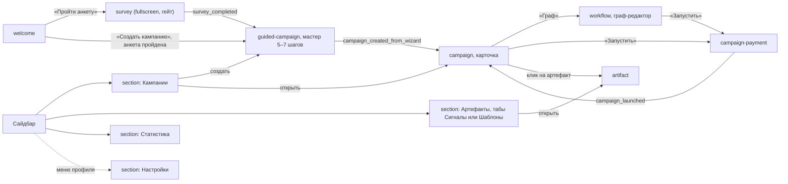
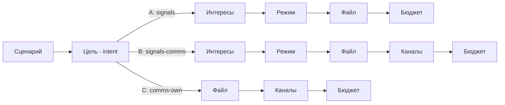
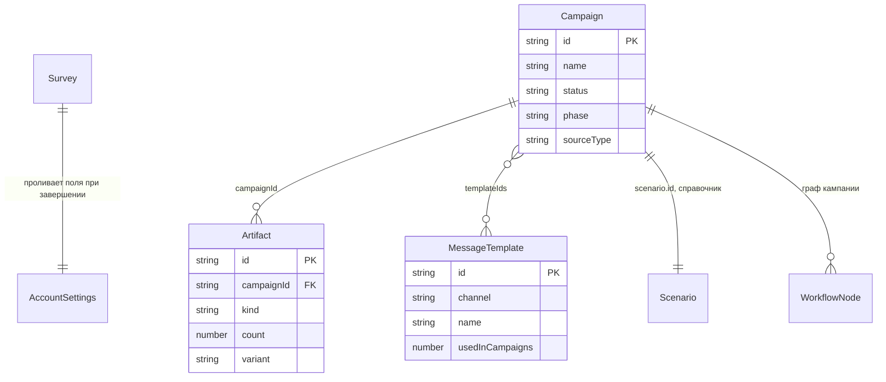
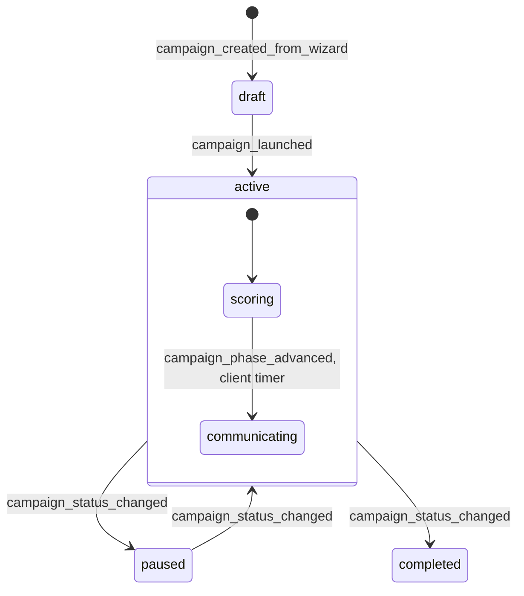

# Afina — карта фронта для синка с бэком

---

## 1. Карта экранов и навигации

### Оболочка (всегда на экране, кроме survey)

**Сайдбар** (`app-sidebar.tsx`, 120px) — сверху лого (клик → `go_welcome`), затем «Последнее» (открывает flyout) и ровно три пункта `SectionName`: **«Кампании»**, **«Артефакты»**, **«Статистика»** — в этом порядке. Амбер-бейдж — только на «Артефакты» (`notifications.signalsBadge`). Внизу — баланс и меню профиля (аватар «АК», «Арслан К.», `arslan@afina.ai`) с тремя пунктами: **«Настройки»** (единственный вход в 4-й раздел), «Финансы» и «Выйти» (обе без обработчика).

**Flyout «Последнее»** (`launch-flyout.tsx`) — список последних 10 кампаний с поиском; клик открывает кампанию. Про сигналы/артефакты в нём ничего нет.

**Промпт-бар / чат** — `ShellBottomBar` почти везде, кроме мастера (`ChatPanel`) и режима `chat.mode==="sidebar"` (тогда всем владеет `ChatDrawer`).

### Экраны (`view.kind`)

| Экран | Компонент | Назначение | Входит по | Выходит по |
|---|---|---|---|---|
| `welcome` | `WelcomeView` | Стартовый экран | старт приложения; клик по лого | «Пройти анкету»/«Создать кампанию» → `survey`/`guided-campaign` |
| `survey` | `SurveySection` (fullscreen) | Анкета — гейт перед мастером | `open_survey`; авто при `start_campaign_flow`, если анкета не пройдена | `survey_completed` → повторный `start_campaign_flow`; Esc → `go_welcome` |
| `guided-campaign` | `GuidedCampaignSection` | Мастер кампании (5–7 шагов) | `start_campaign_flow` после гейта анкеты | `campaign_created_from_wizard` → `campaign` |
| `campaign` | `CampaignScreen` | Карточка кампании | `campaign_opened`, конец мастера, `campaign_launched` | «Граф» → `workflow`; «Запустить» → `campaign-payment` |
| `workflow` | `WorkflowSection` | Граф-редактор логики (draft — editable, launched — read-only) | `open_workflow` | «Запустить» → `campaign-payment`; назад → `campaign` |
| `campaign-payment` | `CampaignPaymentScreen` | Бюджет + оплата + запуск | `open_campaign_payment` | назад → `workflow`; `campaign_launched` → `campaign` |
| `artifact` | `ArtifactScreen` | Деталь артефакта/коллекции | `artifact_opened` | контекстное «назад» — туда, откуда открыли |
| `section` «Кампании» | `CampaignsSection` | Список, фильтры, создание | `sidebar_nav` | «Создать» → мастер; карточка → `campaign` |
| `section` «Артефакты» | `ArtifactsSection` (табы «Сигналы»/«Шаблоны») | Список артефактов и библиотека шаблонов | `sidebar_nav` | строка → `artifact` |
| `section` «Статистика» | `StatisticsSection` | Отчёт-куб | `sidebar_nav`, `goto_stats` | — |
| `section` «Настройки» | `SettingsSection` | Профиль аккаунта | `sidebar_nav` из меню профиля | — |

Back/forward браузера работает через `src/hooks/use-view-history.ts` (`popstate` → `restore_address`), но адресуется грубее, чем `View`: `ViewAddress` не хранит `launched`/выбранную ноду; `survey` в истории схлопывается в `welcome`.

---

## 2. User flows по ключевым сценариям

### 2.1 Создание кампании (мастер)

Мастер — **не 8 шагов, как в старых доках**, а **5–7 в зависимости от ветки**, вычисляется `stepsForIntent()`. Ветка выбирается на шаге «Цель» (`intent`):

- **A — `signals`** («Только сигналы»): Сценарий → Цель → Интересы → Режим → Файл → Бюджет (6 шагов)
- **B — `signals-comms`** («Сигналы + коммуникация»): + Каналы (7 шагов)
- **C — `comms-own`** («Коммуникация по своим сигналам»): Сценарий → Цель → Файл → Каналы → Бюджет (5 шагов, без Интересов/Режима)

| # | Шаг | Что делает пользователь | Блокирует «Далее», если |
|---|---|---|---|
| 1 | Сценарий | Клик по карточке = сразу next | — |
| 2 | Цель (`intent`) | «Только сигналы» / «Сигналы + коммуникация» / «Коммуникация по своим сигналам» | intent не задан (по умолчанию есть) |
| 3 (A/B) | Интересы | Общий редактор интересов/триггеров | нет ни интереса, ни триггера |
| 4 (A/B) | Режим (`analysisMode`) | «Разовый» / «Потоковый» | — |
| 5 (A/B), 3 (C) | Файл | Загрузка базы CSV/XLSX/TXT | файлов нет; идёт хеширование |
| 6 (B), 4 (C) | Каналы | Мультивыбор sms/push/email/ivr, цена за отправку | ни один канал не выбран |
| последний | Бюджет | «Рекомендуемая» / «Своя сумма» + дневной потолок (поток) | сумма ≤ 0 |

`sourceType` не выбирается напрямую — `deriveSourceType(intent, analysisMode)`: `comms-own` → `own`; иначе `stream`, если режим потоковый, иначе `new`. Смена сценария сбрасывает весь хвост; смена цели сбрасывает всё после неё.

> **Где реально проверяется баланс:** шаг «Бюджет» — только прогноз (без чтения баланса, кнопка «Далее»). Мастер сразу создаёт `draft`-кампанию и открывает карточку. Проверка баланса/пополнение — только на отдельном экране `campaign-payment`, после мастера, с карточки или из графа.

### 2.2 Граф кампании — два способа редактирования

Канвас (`@xyflow/react`) не поддерживает drag/manual-connect. Всё — через промпт-бар:

1. **Точечная правка поля ноды.** Клик по ноде → чип `@ИмяНоды` в композере → текст парсится по `key: value` (`node-actions.ts`): `текст: Скидка 20% сегодня`, `alpha-name: BRAND`, `время: сразу`. Поля с `control:"template"` вместо парсинга открывают пикер шаблона.
2. **Структурные команды** (без выбора ноды): `добавь Email после СМС`, `вставь Push перед Успех`, `добавь Задержка между СМС и Email`, `убери Push`, `замени СМС на Push`, цепочкой через запятую. Удалять можно только `sms/email/push/ivr/wait/split/condition` — `signal/scoring/success/end` защищены.

### 2.3 Запуск и оплата

`CampaignPaymentScreen`: разбивка стоимости (Сигналы/Скоринг + Коммуникация), «Рекомендуемая»/«Своя сумма», прогноз касаний, проверка баланса с модалкой пополнения. По кнопке — `campaign_launched {id, timestamp, budget, dailyBudget?}` → статус `active`, фаза `scoring`.

**Единственный реальный гейт запуска** — BFS-достижимость ноды `success` от первой ноды графа. «Требует внимания» (незаполненное поле) — предупреждение, не блокер (явно закомментировано в коде как отменённое поведение). «Сигнал не привязан» всегда `false` (легаси-условие).

### 2.4 Прогресс после запуска

`active` всегда стартует в фазе `scoring`. Не-поток + коммуникация: «Отправка провайдерам» (8с) → «Проверка провайдерами» (8с) → «Обработка базы» (~30с) → «Коммуникация по сигналам» → «Кампания завершена». Без коммуникации — без последнего шага. Поток: «Подключение к провайдерам» (8с) → «Обработка и коммуникация». Таймер замораживается на паузе.

### 2.5 Статистика

Период → группировка строк/подстрок (дни, недели, месяцы, офферы, абоненты, каналы, креативы, триггеры, лендинги, кампании, сценарии, шаблоны, стратегии, рекламодатели, поставщики трафика) → колонки-метрики (Номера, Сигналы, Approves, Expenses, Income, Holds, Rejects, Clicks, Sends, Actions, AR%, RR%) → фильтры «По значениям»/«Исключить из поиска» → клик по строке — поповер-детализация → экспорт CSV / сохранение как шаблон отчёта.

### 2.6 Настройки

Семь блоков (Сайт → Бизнес → Регионы → Саммари → Интересы → Тон бренда → Глобальные исключения доменов), все с автосохранением, кроме «Саммари» — там ручное «Сохранить» (старые доки ошибочно называли этот блок read-only).

---

## 3. Модель сущностей фронта

Все имена — дословно из TypeScript (`src/state/app-state.ts`, если не указан иной файл).

### Campaign

| Поле | Тип | Комментарий |
|---|---|---|
| `id` | `string` | `cmp_<nanoid6>` |
| `name` | `string` | |
| `status` | `"draft"\|"active"\|"paused"\|"completed"` | см. §4 |
| `createdAt` / `launchedAt?` / `pausedAt?` / `completedAt?` | `string` (ISO) | |
| `budget?` | `number` | выставляется `campaign_launched` |
| `sourceType?` | `"new"\|"stream"\|"own"` | производное от мастера |
| `channels?` | `Channel[]` | `"sms"\|"push"\|"email"\|"ivr"` |
| `interests?` / `triggers?` | `string[]` | редактируются в скоринг-дровере |
| `files?` | `CampaignFile[]` | `{name, rowCount}` |
| `dailyBudget?` | `number` | расчётный, пересчитывается при запуске |
| `maxDailyBudget?` | `number` | потолок из визарда, не пересчитывается |
| `phase?` | `"scoring"\|"communicating"` | отличает скоринг от коммуникации при `status=active` |
| `templateIds?` | `string[]` | FK на `MessageTemplate` |
| `scenario?` | `{id, name}` | FK на каталог `Scenario` |

### StepData (`src/types/campaign.ts`) — снимок мастера

`scenario`, `interests[]`, `triggers[]`, `triggerConfig: Record<string,{add,exclude}>`, `sourceType`, `intent` (`CampaignIntent`), `analysisMode` (`"once"|"stream"`), `channels[]`, `budget`, `files: File[]`, `fileRowCount?`, `budgetMode?` (`"recommended"|"custom"`), `dailyBudget?`, `maxDailyBudget?`.

### Artifact — выход кампании

`id` (`art_<nanoid8>`), `campaignId` (FK), `kind: "signals"|"signals_conversions"`, `count: number`, `createdAt`, `variant?: "single"|"daily"|"cumulative"`, `periodDate?` (`YYYY-MM-DD`, только для `daily`).

### MessageTemplate

`id`, `channel: Channel`, `name`, `content: NodeParams` (форма зависит от канала), `usedInCampaigns: number`.

### Survey / AccountSettings

`Survey`: `companyName`, `companyWebsite` (`@deprecated`, алиас `taskDescription`), `taskDescription?`, `directionId: DirectionId | null`. `SurveyStatus = "not_started" | "completed"`.

| Поле AccountSettings | Тип | Блок в «Настройках» |
|---|---|---|
| `companyWebsite` | `string` | Сайт |
| `companyName` | `string` | Бизнес |
| `directionId` | `DirectionId \| null` | Бизнес |
| `regions` | `string` | Регионы (свободный текст) |
| `aiSummary` | `string` | Саммари (AI, ручное сохранение) |
| `interests` | `AccountInterest[]` | Интересы (активные) |
| `suggestedInterests` | `AccountInterest[]` | Интересы (AI-предложенные) |
| `brandTone` | `string` | Тон бренда |
| `brandMessages` | `string` | Тон бренда (ключевые сообщения) |
| `domainBlocklist` | `string[]` | Глобальные исключения доменов |

### Справочники (не создаются пользователем, `src/data/*`)

`Scenario` (`id, name, description, category, signalType, isBase, isCurated, recommendedSourceType`), `Direction`/`Vertical`/`Interest`/`Trigger`, `SignalType` (6 значений: Регистрация, Первая сделка, Апсейл, Реактивация, Возврат, Удержание) — только enum-тег сценария/пресета, не отдельная сущность.

### WorkflowNodeType → NodeParams

| Тип ноды | Категория | Params |
|---|---|---|
| `signal`, `source` | endpoint | входная нода (корень графа) |
| `scoring` | endpoint | `{interests[], triggers[], files[]}` |
| `success` | endpoint | `{goal}` |
| `end` | endpoint | `{reason?}` |
| `split` | logic | `{by:"equal"\|"random"\|"segment", branches}` |
| `wait` | logic | `{mode, durationHours?, untilEvent?}` |
| `condition` | logic | `{trigger}` — заголовок в UI «Взаимодействие» |
| `sms` | communication | `{text, alphaName, scheduledAt, link?}` |
| `email` | communication | `{subject, body, sender, link?, emailId?}` |
| `push` | communication | `{title, body, deeplink?}` |
| `ivr` | communication | `{scenario, voiceType}` |

---

## 4. Состояния и переходы

| Переход | Экшен | Кто диспатчит | Условие |
|---|---|---|---|
| — → `draft` | `campaign_created_from_wizard` | конец мастера | — |
| `draft`/`paused` → `active`, phase→`scoring` | `campaign_launched` | `campaign-payment-screen.tsx` | success-нода достижима; баланс достаточен |
| `scoring` → `communicating` | `campaign_phase_advanced` | клиентский `setTimeout` на карточке | чисто временной, не бэкендное событие |
| `active` → `paused` | `campaign_status_changed` | кнопка «Стоп» | — |
| `paused` → `active` | `campaign_status_changed` | кнопка «Возобновить» | — |
| `*` → `completed` | `campaign_status_changed` | нигде в реальном UI | только dev-пресет |

Единственное реальное блокирующее условие запуска — достижимость ноды `success` (BFS от первой ноды графа). «Требует внимания» — предупреждение, не блокер.

`Survey.status`: `not_started → completed` — один переход (`survey_completed`), плюс dev-обход и сброс.

---

## 5. Маппинг UI → API

> **Здесь основной пробел данных.** Реального бэкенда для домена не существует — весь CRUD живёт в reducer-стейте и теряется при reload. Единственные реальные сетевые вызовы — три прокси к LLM.

| UI-действие | Эндпоинт | Method | Запрос | Ответ | Реальный LLM? |
|---|---|---|---|---|---|
| Сабмит промпт-бара | `/api/ai/assist` | POST | `{text, history≤8, context}` | `{results:[...]}` ≤2 | да, generateText + tools |
| Проверка доступности AI (дев-панель) | `/api/ai/assist` | GET | — | `{available: boolean}` | нет, только наличие ключа |
| «Изменить кампанию» на карточке | `/api/ai/campaign-edit-questions` | POST | `{editText, description}` | `{questions[2]}` | условно; ответы никуда не применяются к графу |
| «Создать шаблон» → канал → интент | `/api/ai/create-template` | POST | `{channel, intent}` | `{variants[~3]}` | условно, иначе заготовки |

**Всё остальное — локальный стейт, без сети:** справочники сценариев/направлений/интересов/триггеров/регионов/провайдеров (`src/data/*.ts`), базовые графы воркфлоу по типу сценария (`state/workflow-templates.ts`), сид-шаблоны сообщений, дев-пресеты (детерминированный PRNG), вся статистика (посчитана на клиенте, см. §6), «AI-заполнение» письма (regex-мок, не LLM).

**Персистентность:** ничего доменного не переживает reload. Через `localStorage` сохраняются только dev-флаги (`afina.dev.preset`, `afina.dev.direction` и т.п.) — не часть пользовательского флоу.

---

## 6. Известные расхождения и допущения

### Симулированное поведение, которое пользователь видит как настоящее

- Потоковые диджесты: UI обещает «каждый день в 00:00», реальный таймер — 7 секунд (задокументировано как «accelerated demo cadence»), лимит 14 диджестов
- CSV-выгрузка сигналов — детерминированный мок, потолок 2000 строк «для прототипа»
- Статистика: реальные измерения — кампании/даты/шаблоны/охват (сумма реальных `Artifact.count`); остальные измерения (офферы, абоненты, креативы и т.д.) и вся воронка (клики/approve/expenses…) — seeded-случайные, не измеренные события
- Прогресс-этапы кампании — клиентские таймеры, не реальные бэкенд-события

### Допущения фронта о бэке — нужно проектировать заново

- **Нет модели пользователя/авторизации.** Профиль захардкожен («Арслан К.», `arslan@afina.ai`); нет логина, сессий, мультитенантности
- **Нет реального биллинга.** `balance` — число в стейте; `balance_topup` прибавляет произвольную сумму без платёжного провайдера
- **Нет реальной обработки файлов.** Хеш/строки считаются локально псевдослучайным генератором
- **AI работает по regex** там, где это не один из 3 реальных `/api/ai/*` вызовов — соответствует `PRODUCT.md` («Цель прототипа — валидировать UX, не перформанс»)
- `domainBlocklist` — редактируемое поле без единого downstream-эффекта; реальную фильтрацию доменов нужно проектировать с нуля
