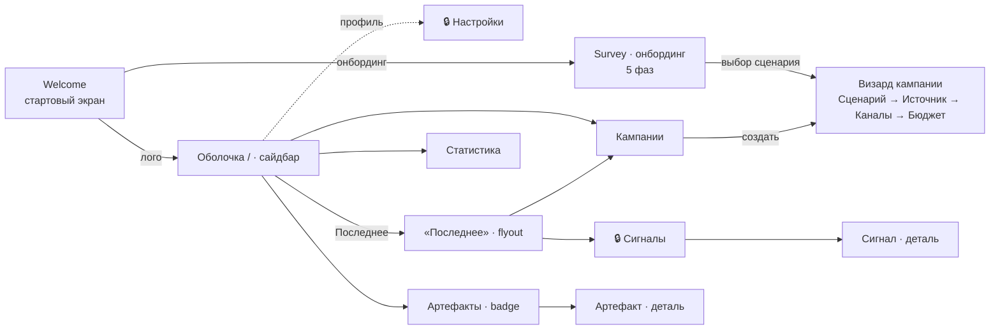
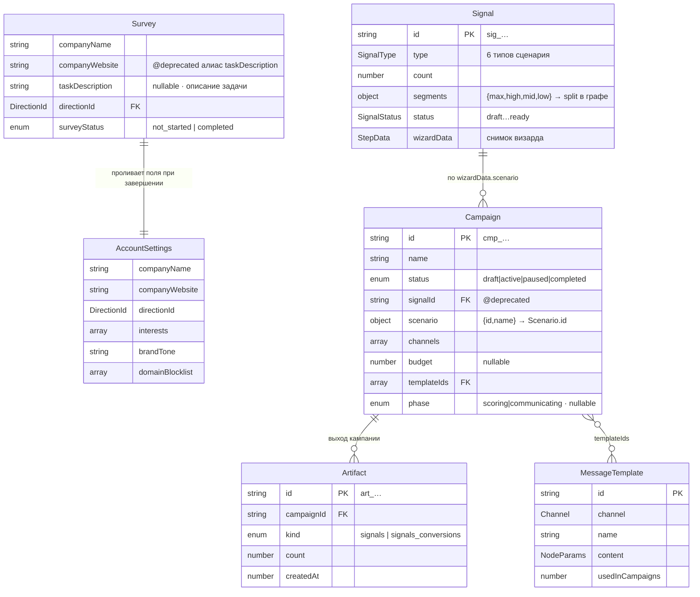
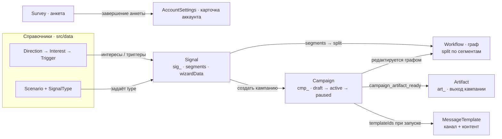

# Карта продукта Afina — разделы, сущности, зависимости

> Срез по ветке `integration`. Полная карта: как связаны разделы, какие сущности есть и как они порождаются друг из друга.

## Что это за продукт

Afina — **single-page приложение** (Next.js 16 App Router): ровно один URL-маршрут `/` плюс один API `/api/ai/assist`. Всё, что выглядит как «переходы между разделами», — это смена `state.view` в едином reducer (`src/state/app-state.ts`), а не навигация по URL. Доменных данных в БД нет — все сущности живут в этом же reducer-стейте.

Карта читается в три слоя:

1. **Навигация** — куда пользователь может попасть и через что.
2. **Сущности** — что хранится и как одно ссылается на другое.
3. **Жизненный цикл** — какое действие порождает какую сущность.

Статистика показана упрощённо — это раздел-потребитель данных, он ничего не создаёт.

---

## 1. Карта навигации

Вход — `Welcome`. Онбординг ведёт через `Survey` к визарду кампании. Дальше всё крутится вокруг оболочки с сайдбаром. **«Сигналы» и «Настройки» намеренно скрыты** из основного сайдбара — в них попадают через flyout «Последнее» и меню профиля.

Сплошные стрелки — основной путь; пунктир — вход через меню профиля. 🔒 — разделы вне основного сайдбара.

---

## 2. Сущности и их связи

Четыре коллекции в стейте (`signals`, `campaigns`, `artifacts`, `templates`) плюс одиночные слайсы (`survey`, `accountSettings`). `Scenario` / `Direction` / `Interest` / `Trigger` — это **справочники** из `src/data/`, не создаются пользователем.

---

## 3. Жизненный цикл: что порождает что

Главная цепочка слева направо: **анкета → сигнал → кампания → артефакт**. Справочники только питают данные. Граф workflow — редактор кампании, сегменты сигнала задают его split-ветки.

### Таблица: действие → сущность

| Действие пользователя | Где | Создаёт / меняет | Action |
|---|---|---|---|
| Завершить анкету | Survey | заполняет `survey`, сидит `accountSettings` | `survey_completed` |
| Завершить визард сигнала / загрузить базу | guided-flow / upload-dialog | **Signal** (`sig_…`) | `signal_added` |
| «Создать кампанию» из сигнала | деталь/список сигнала | **Campaign** (draft, scenario из сигнала) | `campaign_from_signal` |
| Запуск кампании (после оплаты) | экран оплаты | Campaign → `active`, мердж шаблонов | `campaign_launched` |
| Старт / пауза / возобновление | workflow / деталь | смена `status` + даты | `campaign_status_changed` |
| Готовность артефакта | (только reducer) | **Artifact** (`art_…`), зажигает badge | `campaign_artifact_ready` |

---

## Незавершённые провода (на ветке integration)

Это не баги, а недоделанная миграция — но без них карта вводит в заблуждение.

> ⚠️ **Артефакты не рождаются «вживую».** Action `campaign_artifact_ready` определён в reducer (`app-state.ts:584`), но его не диспатчит ни один UI/таймер. Артефакты появляются только через dev-пресеты (`preset_applied`).

> ⚠️ **Шаблоны не инкрементируются при запуске.** Reducer `campaign_launched` умеет мерджить `templates`, но `campaign-payment-screen.tsx:186` диспатчит без этого поля. В рантайме `MessageTemplate` = только `PRESET_TEMPLATES`.

> ℹ️ **`companyWebsite` ↔ `taskDescription`** — миграция в процессе: форма пишет текст в оба поля, reducer читает legacy `companyWebsite`, и оно проливается в «сайт компании» в Настройках.

---

## Карта файлов

| Файл | Что | Ориентиры |
|---|---|---|
| `src/state/app-state.ts` | Сердце: стейт, `View`, reducer | `View` 197–207; сущности `Signal`:46 / `Campaign`:79 / `Artifact`:119 / `MessageTemplate`:131; кейсы `signal_added`:454, `campaign_from_signal`:554, `campaign_artifact_ready`:584, `survey_completed`:930, `campaign_launched`:1067 |
| `src/app/page.tsx` | Шелл и «роутинг» | `renderMain()` (78–105) диспатчит экран по `view.kind` |
| `src/sections/shell/app-sidebar.tsx` | Сайдбар | `navItems` (44–48): 3 видимых пункта; меню профиля (140–152) |
| `src/sections/artifacts/artifacts-section.tsx` | Раздел Артефакты | Табы Сигналы\|Шаблоны (33–44) |
| `src/sections/campaigns/wizard/campaign-stepper.tsx` | Визард кампании | `STEPPER_ITEMS` (6–11): 4 шага |
| `src/sections/survey/survey-section.tsx` | Онбординг | `Phase` (16–21): форма→awaiting→interests→matching→scenarios |
| `src/types/` | Типы сущностей | `survey.ts`, `campaign.ts` (StepData), `workflow.ts`, `directions.ts`, `signal-status.ts` |
