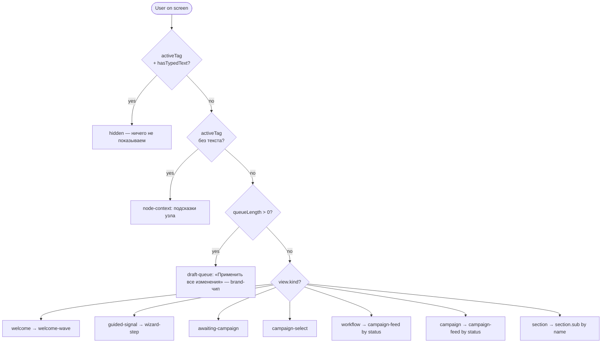

# Карта подсказок PromptBar

Полная карта чипов-подсказок, которые показываются в PromptBar: где, в каком
состоянии и что происходит по клику. Источник — реестр
`src/state/suggestion-registry/`. Документ структурирован для конвертации в
визуальное представление (диаграмма состояний, mindmap, sankey).

## Как читать

- **Scope** — «место», в котором сейчас находится пользователь. Выбирается
  селектором `selectPromptSuggestions(state, ctx)` из `AppState`.
- **Под-состояние** — детали Scope (например, фильтр кампаний, период
  статистики, статус кампании в feed'е).
- **Чип** — `{ id, label, action, variant? }`. `id` — стабильный ключ,
  `label` — текст в чипе.
- **Действие** — что произойдёт по клику. Один из пяти `action.kind`:

| action.kind | Что делает |
|---|---|
| `insert-text` | Вставляет `fullText` в инпут после активного тега (`textInput.insertAtCursor` с `separator: smart, preserveTags: true`). Пользователь видит подсказку в текстовом поле и может отредактировать / нажать Enter. |
| `submit` | Сразу отправляет фразу `phrase` в чат через `chatSubmit({ text, segments: [] })` и очищает инпут. Используется там, где ответ должен прийти от AI без правки пользователем. |
| `dispatch` | Диспатчит `action` напрямую в reducer (`useAppDispatch`). Меняет AppState (например, фильтр кампаний, флаг `budgetHelpShown`, открывает wizard). |
| `chat-submit` | Передаёт `chip` в `welcomeChat.submitChip(chip)` — ведёт пользователя по диалоговому графу WAVES. |
| `command` | Системная команда. Сейчас одна — `apply-all`: применяет все черновики из очереди и вставляет `APPLY_ALL_COMMAND` в инпут. |

- **Variant** — визуальный hint: `default` (тёмный) или `brand` (жёлтый
  акцент — только для apply-all).

## Приоритеты (selectPromptSuggestions)



## Общая структура (mindmap)

```mermaid
mindmap
  root((PromptBar suggestions))
    node-context
      sms
      email
      push
      ivr
      wait
      condition
      split
      signal
      success
      end
      storefront
      landing
      merge
      (fallback) generic
    draft-queue
      apply-all (brand)
    welcome-wave
      WAVE_0
      WAVES[s1-w1, s2-w1, ...]
    section
      campaigns
        пусто → онбординг
        с фильтром → reset + сорт + статусы
      statistics
        по period
        по rowKind
      signals
        пусто → онбординг
        по статусам
      settings
        тариф / интеграции / уведомления
    wizard-step
      1: сценарий (6 вариантов)
      2: интересы × домены (4 ветки)
      3: база
      4: объём
      5: бюджет (2 ветки)
      6: имя сигнала (2 ветки)
      7: запуск
      8: результат
    awaiting-campaign
    campaign-select
    campaign-feed
      draft / scheduled / active / paused / completed
```

---

## 1. Node-context (активный тег узла)

Когда в инпуте есть активный тег узла без напечатанного текста после него,
показываются подсказки, специфичные для типа узла и поля. Все действия — `insert-text`.

### sms

| paramLabel | id | label | вставится |
|---|---|---|---|
| Текст | sms-text-shorter | Короче | сделай текст короче, до 1 SMS-сегмента |
| Текст | sms-text-friendly | Дружелюбнее | перепиши текст в более тёплом, дружелюбном тоне |
| Текст | sms-text-benefit | Добавить выгоду | добавь в текст конкретную выгоду для клиента |
| Alpha-name | sms-alpha-brand | Имя бренда | поставь alpha-name с названием нашего бренда |
| Alpha-name | sms-alpha-short | Короткое имя | сделай alpha-name короче, до 11 символов |
| Время | sms-time-morning | Утро буднего дня | отправлять в 10:00 по будням |
| Время | sms-time-now | Сразу | отправлять сразу после входа в сегмент |
| Ссылка | sms-link-short | Короткая ссылка | поставь сокращённую ссылку с UTM-метками |
| Ссылка | sms-link-landing | На лендинг | веди ссылку на посадочную страницу акции |
| _whole-node_ | sms-node-laconic | Сделать лаконичнее | сократи сообщение и убери лишние детали |
| _whole-node_ | sms-node-cta | Усилить призыв | усиль призыв к действию в конце сообщения |

### email

| paramLabel | id | label | вставится |
|---|---|---|---|
| Тема | email-subj-catchy | Цепляющая тема | сделай тему письма цепляющей, до 50 символов |
| Тема | email-subj-nospam | Без спам-слов | перепиши тему без слов-триггеров спам-фильтров |
| Текст | email-body-shorter | Короче | сократи тело письма, оставь только суть |
| Текст | email-body-struct | Добавить структуру | разбей текст письма на абзацы с подзаголовками |
| Текст | email-body-formal | Деловой тон | перепиши письмо в более деловом тоне |
| Отправитель | email-from-brand | От имени бренда | поставь отправителем имя нашего бренда |
| Отправитель | email-from-person | Личное имя | сделай отправителем имя конкретного менеджера |
| Ссылка | email-link-utm | С UTM-метками | добавь UTM-метки в ссылку для трекинга |
| Ссылка | email-link-landing | На лендинг | веди ссылку на посадочную страницу акции |
| _whole-node_ | email-node-openrate | Повысить открываемость | перепиши письмо так, чтобы повысить открываемость |
| _whole-node_ | email-node-compress | Сократить целиком | сократи письмо целиком в полтора раза |

### push

| paramLabel | id | label | вставится |
|---|---|---|---|
| Заголовок | push-title-short | Короче | сократи заголовок до 30 символов |
| Заголовок | push-title-cta | С призывом | перепиши заголовок с явным призывом к действию |
| Текст | push-body-shorter | Короче | сделай текст пуш-уведомления компактнее |
| Текст | push-body-emoji | С эмодзи | добавь подходящее эмодзи в начало текста |
| Текст | push-body-benefit | Добавить выгоду | добавь конкретную выгоду для клиента |
| Deeplink | push-deeplink-screen | На нужный экран | веди deeplink на профильный экран приложения |
| Deeplink | push-deeplink-utm | С UTM-метками | добавь UTM-метки в deeplink для трекинга |
| _whole-node_ | push-node-concise | Сделать лаконичнее | сократи пуш и убери лишние детали |
| _whole-node_ | push-node-urgency | Добавить срочность | добавь ощущение срочности — ограниченное время или количество |

### ivr

| paramLabel | id | label | вставится |
|---|---|---|---|
| Сценарий | ivr-scenario-short | Короче | сократи сценарий звонка до главного |
| Сценарий | ivr-scenario-warm | Теплее | перепиши сценарий в более тёплом, человеческом тоне |
| Голос | ivr-voice-female | Женский | выбери женский голос |
| Голос | ivr-voice-male | Мужской | выбери мужской голос |
| Голос | ivr-voice-neutral | Нейтральный | выбери нейтральный голос |
| _whole-node_ | ivr-node-concise | Сделать короче | сократи общую длительность звонка |
| _whole-node_ | ivr-node-natural | Естественнее | сделай звонок естественнее, меньше шаблонных фраз |

### wait

| paramLabel | id | label | вставится |
|---|---|---|---|
| Длительность | wait-dur-1h | 1 час | поставь паузу 1 час |
| Длительность | wait-dur-24h | 24 часа | поставь паузу 24 часа |
| Длительность | wait-dur-3d | 3 дня | поставь паузу 3 дня |
| До события | wait-event-open | До открытия | ждать до открытия сообщения |
| До события | wait-event-click | До клика | ждать до клика по ссылке |
| _whole-node_ | wait-node-shorter | Сократить ожидание | сделай паузу короче, чтобы быстрее догнать сегмент |
| _whole-node_ | wait-node-longer | Удлинить ожидание | увеличь паузу, чтобы дать клиенту больше времени |

### condition

| paramLabel | id | label | вставится |
|---|---|---|---|
| Триггер | cond-trigger-opened | По открытию | поставь условие: клиент открыл сообщение |
| Триггер | cond-trigger-clicked | По клику | поставь условие: клиент кликнул по ссылке |
| Триггер | cond-trigger-notdelivered | Без доставки | поставь условие: сообщение не доставлено |
| _whole-node_ | cond-node-strict | Ужесточить условие | сделай условие ветвления строже |
| _whole-node_ | cond-node-loose | Ослабить условие | сделай условие мягче, чтобы захватить больше клиентов |

### split

| paramLabel | id | label | вставится |
|---|---|---|---|
| По | split-by-segment | По сегменту | разделяй по сегменту аудитории |
| По | split-by-random | Случайно | разделяй случайно для A/B-теста |
| Ветки | split-branches-2 | 2 ветки | сделай 2 равные ветки |
| Ветки | split-branches-3 | 3 ветки | сделай 3 ветки |
| _whole-node_ | split-node-balance | Уравновесить | сделай ветки одинакового объёма |
| _whole-node_ | split-node-skew | Сместить трафик | пусти 80% трафика в первую ветку, 20% — во вторую |

### signal

| paramLabel | id | label | вставится |
|---|---|---|---|
| _whole-node_ | signal-node-narrow | Сузить аудиторию | сузь сегмент до самых горячих сигналов |
| _whole-node_ | signal-node-wide | Расширить охват | расширь сегмент, добавь средне-тёплые сигналы |
| _whole-node_ | signal-node-fresh | Свежие сигналы | оставь только сигналы за последние 7 дней |

### success

| paramLabel | id | label | вставится |
|---|---|---|---|
| Цель | success-goal-purchase | Покупка | цель — клиент совершил покупку |
| Цель | success-goal-form | Заявка | цель — клиент оставил заявку |
| Цель | success-goal-visit | Визит | цель — клиент посетил сайт |
| _whole-node_ | success-node-clarify | Уточнить условие | уточни, что именно считается успехом |

### end

| paramLabel | id | label | вставится |
|---|---|---|---|
| Причина | end-reason-converted | Сконвертирован | причина — клиент сконвертирован |
| Причина | end-reason-unsub | Отписка | причина — клиент отписался |
| Причина | end-reason-timeout | Таймаут | причина — истёк срок сценария |
| _whole-node_ | end-node-clarify | Указать причину | добавь конкретную причину выхода из сценария |

### storefront

| paramLabel | id | label | вставится |
|---|---|---|---|
| Офферы | storefront-offers-top | Топ-офферы | оставь в витрине только самые конверсионные офферы |
| Офферы | storefront-offers-personal | Под клиента | подбери офферы под профиль клиента |
| _whole-node_ | storefront-node-refresh | Обновить витрину | перебери витрину под текущий сегмент |

### landing

| paramLabel | id | label | вставится |
|---|---|---|---|
| CTA | landing-cta-strong | Сильнее | усиль call-to-action на лендинге |
| CTA | landing-cta-clear | Прозрачнее | сделай CTA однозначным, без вариантов толкования |
| Оффер | landing-offer-personal | Под клиента | сделай оффер под профиль клиента |
| Оффер | landing-offer-benefit | Подсветить выгоду | вынеси главную выгоду в первый экран |
| _whole-node_ | landing-node-clean | Убрать лишнее | убери с лендинга всё, что отвлекает от цели |

### merge

| paramLabel | id | label | вставится |
|---|---|---|---|
| _whole-node_ | merge-node-dedup | Без дублей | при слиянии убери дубли клиентов из веток |
| _whole-node_ | merge-node-priority | С приоритетом | при дубле сохрани клиента из ветки с большим весом |

### Fallback (неизвестный nodeType или paramLabel)

| Условие | id | label | вставится |
|---|---|---|---|
| Неизвестный `nodeType` | generic-shorter | Сделать короче | сделай текст короче и яснее |
| Неизвестный `nodeType` | generic-tone | Сменить тон | перепиши в более дружелюбном тоне |
| Неизвестный `nodeType` | generic-benefit | Добавить выгоду | добавь конкретную выгоду для клиента |
| Известный `nodeType` + неизвестный `paramLabel` | — | (whole-node набор) | — |

---

## 2. Draft-queue (apply-all)

Появляется когда `queueLength > 0` и **нет** активного тега. Один чип, brand-variant (жёлтый).

| id | label | action | результат |
|---|---|---|---|
| cmd-apply-all | Применить все изменения | command apply-all | очищает все чипы + очередь черновиков, применяет каждый draft через `applyDraftToNode`, вставляет команду в инпут |

---

## 3. Welcome-wave (адаптер WAVES)

Показывается на welcome-экране, когда `useOnboardingChat().chips` не пуст.
Каждый чип графа `WAVES` маппится в `SuggestionItem` с действием
`chat-submit`: передаёт сам `Chip` в `welcomeChat.submitChip`, который ведёт
по диалоговому графу.

Контент чипов **не дублируется** в реестре — источником истины остаётся
`src/sections/welcome/onboarding-chat.ts`. Точки графа:

- `WAVE_0_CHIPS` — стартовые 3 вопроса («Что такое сигнал?», «Откуда берутся
  данные?», «Что я могу сделать со своей базой?»)
- `WAVES["s1-w1"]`, `WAVES["s1-w2a"]`, `WAVES["s1-w2b"]`, … — ответвления
  второго и третьего слоя
- `WAVE_3_CHIPS` — общая концовка с CTA «Создать первый сигнал →»
- `POST_ONBOARDING_CHIPS` — чипы после первой кампании

Перевод чипа в подсказку: `id = "welcome-" + chip.id`, `label = chip.label`,
`action = { kind: "chat-submit", chip }`.

---

## 4. Section — главная навигация

### Кампании

Sub-state: `{ hasCampaigns, activeFilter: CampaignStatus[], sort: CampaignSort }`.

**Пусто (`hasCampaigns: false`)**

| id | label | action | результат |
|---|---|---|---|
| sec-camp-onboard-create | Создать первую кампанию | dispatch `start_signal_flow` | открывает мастер создания сигнала |
| sec-camp-onboard-tour | Как устроены кампании? | insert-text «расскажи, как устроены кампании в Афине» | пользователь нажимает Enter — AI отвечает |

**Есть кампании (`hasCampaigns: true`)** — динамика: уже выбранные status'ы вычитаются, выбранная сортировка не предлагается, при любом активном фильтре/сорте сверху появляется «Сбросить фильтр».

| id | label | action | условие появления |
|---|---|---|---|
| sec-camp-reset | Сбросить фильтр | dispatch `campaigns_filter_clear` | activeFilter не пуст ИЛИ sort ≠ default |
| sec-camp-profit | Самые прибыльные | dispatch `campaigns_query_set {statuses:[], sort: profit-desc}` | sort ≠ profit-desc |
| sec-camp-conversion | По конверсии | dispatch `campaigns_query_set {statuses:[], sort: conversion-desc}` | sort ≠ conversion-desc |
| sec-camp-active | Активные кампании | dispatch `campaigns_query_set {statuses:[active], sort: default}` | `active` ∉ activeFilter |
| sec-camp-scheduled | Запланированные | dispatch `campaigns_query_set {statuses:[scheduled], sort: default}` | `scheduled` ∉ activeFilter |
| sec-camp-paused | На паузе | dispatch `campaigns_query_set {statuses:[paused], sort: default}` | `paused` ∉ activeFilter |
| sec-camp-completed | Завершённые | dispatch `campaigns_query_set {statuses:[completed], sort: default}` | `completed` ∉ activeFilter |
| sec-camp-draft | Черновики | dispatch `campaigns_query_set {statuses:[draft], sort: default}` | `draft` ∉ activeFilter |

Реестр выдаёт максимум: 1 reset + 1 sort + 3 фильтра.

### Статистика

Sub-state: `{ period: PeriodPreset, rowKind: RowKind }`. Все действия — `submit`.

**Чип сравнения** (зависит от текущего period):

| period | id | label | фраза в чат |
|---|---|---|---|
| today | sec-stats-vs-yesterday | Сравни со вчера | сравни с вчера |
| this-month / last-month | sec-stats-vs-prev-month | Сравни с прошлым месяцем | сравни с прошлым месяцем |
| this-quarter / last-quarter | sec-stats-vs-prev-quarter | Сравни с прошлым кварталом | сравни с прошлым кварталом |
| this-year / last-year | sec-stats-vs-prev-year | Сравни с прошлым годом | сравни с прошлым годом |
| прочее (custom, yesterday) | sec-stats-vs-prev | Сравни с предыдущим периодом | сравни с предыдущим периодом |

**Чипы группировки** (зависят от rowKind):

| rowKind | label | label | фразы в чат |
|---|---|---|---|
| campaigns | Разбей по каналам · Топ-10 по доходу | sec-stats-by-channels / sec-stats-top-campaigns | разбей по каналам / топ-10 кампаний по доходу |
| channels | Разбей по кампаниям · Разбей по креативам | sec-stats-by-campaigns / sec-stats-by-creatives | разбей по кампаниям / разбей по креативам |
| triggers / landings / creatives | Разбей по кампаниям · Топ по конверсии | sec-stats-by-campaigns2 / sec-stats-top-conversion | разбей по кампаниям / топ-10 по конверсии |
| days / weekdays / weeks / months | Лучший день · Покажи тренд | sec-stats-best-day / sec-stats-trend | найди лучший день по доходу / покажи тренд за период |
| прочее | Разбей по кампаниям · Сравни каналы | sec-stats-by-campaigns3 / sec-stats-channels-cmp | разбей по кампаниям / сравни эффективность каналов |

Реестр отдаёт первые 3 чипа (compare + 2 от rowKind).

### Сигналы

Sub-state: `{ statusCounts: Record<SignalStatus, number> }`.

**Пусто (все счётчики 0)**

| id | label | action | результат |
|---|---|---|---|
| sec-sig-onboard-create | Создать первый сигнал | dispatch `start_signal_flow` | открывает мастер |
| sec-sig-onboard-explain | Что такое сигнал? | insert-text «расскажи, что такое сигнал и как он устроен» | пользователь жмёт Enter — AI отвечает |

**Есть сигналы** — приоритизация по «требует действия». Берётся max 3:

| id | label | условие | вставится / dispatch |
|---|---|---|---|
| sec-sig-pay | Оплатить ожидающие | awaiting_payment > 0 | insert-text «оплати все сигналы, ожидающие оплаты» |
| sec-sig-errors | Показать ошибки | error > 0 | insert-text «покажи сигналы с ошибкой» |
| sec-sig-processing | В обработке | processing > 0 | insert-text «покажи сигналы в обработке» |
| sec-sig-launch-ready | Запустить готовые | ready > 0 | insert-text «создай кампании на готовых сигналах» |
| sec-sig-expired | Скрыть устаревшие | expired > 0 | insert-text «скрой устаревшие сигналы» |
| sec-sig-new | Новый сигнал | если все остальные приоритеты не сработали | dispatch `start_signal_flow` |
| sec-sig-active2 | Активные сигналы | fallback | insert-text «покажи только активные сигналы» |

### Настройки

Sub-state: `{ hasIntegrations, isBasicTariff }`.

| id | label | условие | вставится |
|---|---|---|---|
| sec-set-tariff-up | Расширить тариф | isBasicTariff = true | insert-text «хочу расширить тарифный план» |
| sec-set-tariff-info | Текущий тариф | isBasicTariff = false | insert-text «покажи детали моего тарифа» |
| sec-set-integrations-add | Подключить интеграции | hasIntegrations = false | insert-text «покажи доступные интеграции и помоги подключить» |
| sec-set-integrations-manage | Управлять интеграциями | hasIntegrations = true | insert-text «покажи мои подключённые интеграции» |
| sec-set-notify | Настроить уведомления | всегда | insert-text «настрой уведомления о новых сигналах и кампаниях» |

---

## 5. Wizard-step (мастер сигнала)

Sub-state — discriminated union по `step`.

### Step 1 — выбор сценария (6 чипов, все insert-text)

| id | label | вставится |
|---|---|---|
| wiz-1-reactivation | Реактивация | хочу сценарий реактивации спящих клиентов |
| wiz-1-retention | Удержание | хочу сценарий удержания клиентов |
| wiz-1-first-deal | Первая сделка | сценарий доведения нового клиента до первой покупки |
| wiz-1-upsell | Апсейл | хочу сценарий апсейла существующих клиентов |
| wiz-1-comeback | Возврат | сценарий возврата ушедших к конкурентам клиентов |
| wiz-1-registration | Регистрация | сценарий доведения до первого действия после регистрации |

### Step 2 — интересы и триггеры (4 ветки)

Sub-state: `{ hasInterests, hasDomains }`.

**Пусто-пусто** (`hasInterests: false, hasDomains: false`)

| id | label | вставится |
|---|---|---|
| wiz-2-fill-by-site | Подобрать по сайту | подбери интересы по сайту компании |
| wiz-2-template | Из шаблона | выбери готовый шаблон интересов |
| wiz-2-domain-first | Начать с домена | добавь сайт конкурента как триггер |

**И-и** (`hasInterests: true, hasDomains: true`)

| id | label | вставится |
|---|---|---|
| wiz-2-narrow | Сузить набор | оставь только самые релевантные интересы и домены |
| wiz-2-widen | Расширить охват | добавь смежные интересы для большего охвата |
| wiz-2-remix | Перегенерировать | перегенерируй набор интересов под мой сайт |

**Только интересы** (`hasInterests: true, hasDomains: false`)

| id | label | вставится |
|---|---|---|
| wiz-2-add-domain | Добавить домен | добавь сайт конкурента как триггер |
| wiz-2-add-competitors | Сайты конкурентов | подбери список сайтов конкурентов |
| wiz-2-narrow2 | Сузить интересы | оставь только самые релевантные интересы |

**Только домены** (`hasInterests: false, hasDomains: true`)

| id | label | вставится |
|---|---|---|
| wiz-2-add-interests | Добавить интересы | подбери интересы под мои триггеры |
| wiz-2-by-site2 | По сайту компании | подбери интересы по сайту компании |
| wiz-2-template2 | Шаблон интересов | выбери готовый шаблон интересов |

### Step 3 — база

| id | label | вставится |
|---|---|---|
| wiz-3-base-upload | Загрузить базу | хочу загрузить свою базу контактов |
| wiz-3-base-template | Шаблон базы | покажи шаблон файла с базой |
| wiz-3-base-format | Какие форматы? | какие форматы файлов вы принимаете |

### Step 4 — объём

| id | label | вставится |
|---|---|---|
| wiz-4-volume-recommend | Рекомендуемый объём | поставь рекомендуемый объём аудитории |
| wiz-4-volume-max | Максимум | поставь максимально возможный объём |
| wiz-4-volume-test | Тестовый объём | сделай минимальный тестовый объём |

### Step 5 — бюджет (2 ветки)

Sub-state: `{ budgetHelpShown }`.

**`budgetHelpShown: false`** — один чип, dispatch:

| id | label | dispatch |
|---|---|---|
| wiz-5-budget-help | Как рассчитывается рекомендуемый бюджет? | `budget_help_shown` (показывает объяснительный блок маскота под инпутом) |

**`budgetHelpShown: true`** — обычный набор, insert-text:

| id | label | вставится |
|---|---|---|
| wiz-5-budget-recommend | Рекомендуемая сумма | поставь рекомендуемый бюджет |
| wiz-5-budget-conservative | Поменьше | уменьши бюджет, мне нужно осторожнее |
| wiz-5-budget-aggressive | Побольше | увеличь бюджет, хочу собрать максимум сигналов |

### Step 6 — имя сигнала (2 ветки)

Sub-state: `{ nameSet }`.

**`nameSet: false`**

| id | label | вставится |
|---|---|---|
| wiz-6-name | Придумать название | придумай ёмкое название для этого сигнала |
| wiz-6-edit2 | Изменить параметры | хочу вернуться и поправить параметры |

**`nameSet: true`**

| id | label | вставится |
|---|---|---|
| wiz-6-rename | Переименовать | придумай другое название для этого сигнала |
| wiz-6-edit | Изменить параметры | хочу вернуться и поправить параметры |
| wiz-6-confirm | Всё ок, далее | всё подходит, переходим к запуску |

### Step 7 — запуск

| id | label | вставится |
|---|---|---|
| wiz-7-launch-now | Запустить сразу | запусти сигнал прямо сейчас |
| wiz-7-launch-later | Отложить запуск | запланируй запуск на завтрашнее утро |
| wiz-7-launch-check | Проверить ещё раз | покажи итоговые параметры перед запуском |

### Step 8 — результат

| id | label | вставится |
|---|---|---|
| wiz-8-next-campaign | Создать кампанию | создай кампанию на этом сигнале |
| wiz-8-next-signal | Ещё один сигнал | хочу создать ещё один сигнал |
| wiz-8-view-stats | Открыть статистику | открой статистику по этому сигналу |

---

## 6. Awaiting-campaign

После создания сигнала, до выбора кампании.

| id | label | вставится |
|---|---|---|
| view-await-campaign-from-signal | Кампанию из сигнала | создай кампанию на основе этого сигнала |
| view-await-campaign-template | Из шаблона | хочу выбрать шаблон кампании |
| view-await-campaign-skip | Пока без кампании | сохрани сигнал, кампанию настрою позже |

## 7. Campaign-select

Выбор сигнала под новую кампанию.

| id | label | вставится |
|---|---|---|
| view-camp-select-recent | Последние | покажи самые свежие сигналы |
| view-camp-select-hot | Только горячие | оставь только самые горячие сигналы |
| view-camp-select-new | Создать новый | создай новый сигнал с нуля |

## 8. Campaign-feed (по статусу кампании)

Sub-state: `{ status: CampaignStatus }`. Workflow без launched → `draft`;
workflow с launched=true и campaign view → реальный status из `state.campaigns`.

### status: draft

| id | label | вставится |
|---|---|---|
| view-feed-draft-launch | Запустить | запусти эту кампанию |
| view-feed-draft-edit | Изменить сценарий | хочу поправить сценарий кампании |
| view-feed-draft-schedule | Запланировать | запланируй запуск на завтра |

### status: scheduled

| id | label | вставится |
|---|---|---|
| view-feed-sched-launch-now | Запустить сейчас | запусти кампанию прямо сейчас, не жди расписание |
| view-feed-sched-cancel | Отменить расписание | отмени запланированный запуск |
| view-feed-sched-reschedule | Перенести запуск | перенеси запуск на другое время |

### status: active

| id | label | вставится |
|---|---|---|
| view-feed-active-stats | Открыть статистику | покажи статистику этой кампании |
| view-feed-active-pause | Поставить на паузу | поставь кампанию на паузу |
| view-feed-active-edit | Доправить сценарий | хочу поправить сценарий по ходу |

### status: paused

| id | label | вставится |
|---|---|---|
| view-feed-paused-resume | Возобновить | возобнови кампанию |
| view-feed-paused-complete | Завершить | заверши эту кампанию |
| view-feed-paused-stats | Что произошло? | покажи, почему я поставил кампанию на паузу |

### status: completed

| id | label | вставится |
|---|---|---|
| view-feed-done-duplicate | Запустить копию | создай копию этой кампании и запусти |
| view-feed-done-analysis | Анализ результата | разбери, что в кампании сработало, а что нет |
| view-feed-done-export | Выгрузить отчёт | выгрузи итоговый отчёт по кампании |

---

## Декодирование «что происходит» по типам действий

- **insert-text** → `textInput.insertAtCursor(fullText, { separator: "smart", preserveTags: true })`. Пользователь видит вставленную фразу в инпуте после активного тега (если есть) и решает дальше: править, нажимать Enter, добавить ещё чип.
- **submit** → `chatSubmit({ text: phrase, segments: [] })` + очистка инпута + `chipsApi.clearChips()`. Аналог нажатия Enter на этой фразе.
- **dispatch** → `useAppDispatch()(action)`. Состояние меняется мгновенно — фильтр кампаний обновляется, мастер открывается, флаг переключается. UI реагирует через свои selectors.
- **chat-submit** → `welcomeChat.submitChip(chip)`. Welcome-чат добавляет user-сообщение, показывает «думаю», подставляет bot-ответ из `WAVES[chip.next].answer` и подсовывает следующий слой чипов.
- **command apply-all** → `chipsApi.clearChips()` + `editorRef.current?.clear()` + `textInput.insertAtCursor(APPLY_ALL_COMMAND, { separator: "none" })`. Дальше PromptBar обрабатывает submit «Применить все изменения» и применяет очередь черновиков.

---

## Источники истины

- Реестр: `src/state/suggestion-registry/{types,registry,node-context,sections,wizard,views,commands,welcome-waves,index}.ts`
- Селектор: `src/state/select-prompt-suggestions.ts`
- Welcome-граф: `src/sections/welcome/onboarding-chat.ts` (WAVES, WAVE_0_CHIPS, WAVE_3_CHIPS, POST_ONBOARDING_CHIPS)
- Apply-all команда: `src/state/prompt-bar-enter.ts:APPLY_ALL_COMMAND`
- Рендер: `src/sections/shell/suggestion-bar.tsx` (тонкий рендерер с flex-wrap)
- Использование в Shell: `src/sections/shell/shell-bottom-bar.tsx` (один `onPick` switch по `action.kind`)
- Использование в Chat sidebar: `src/sections/shell/chat-panel.tsx`
